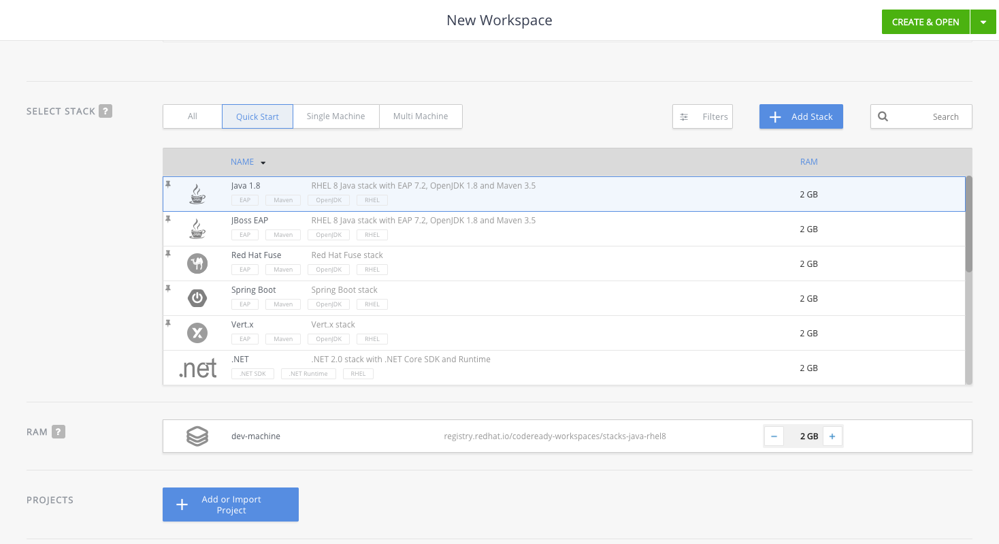
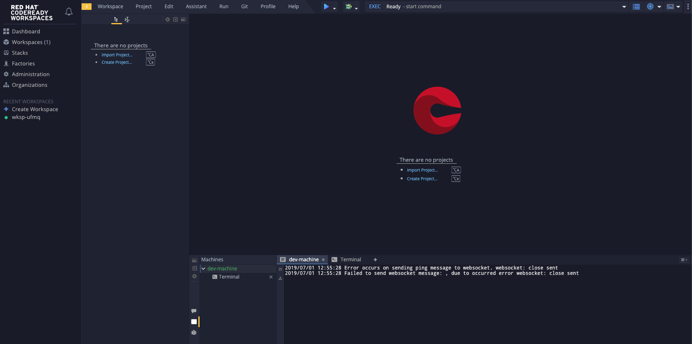
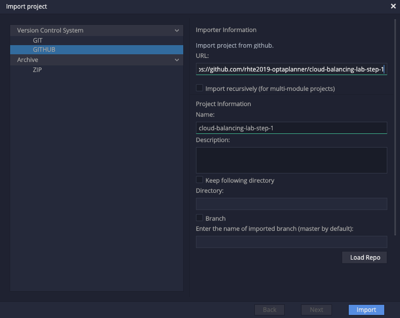
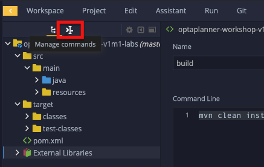
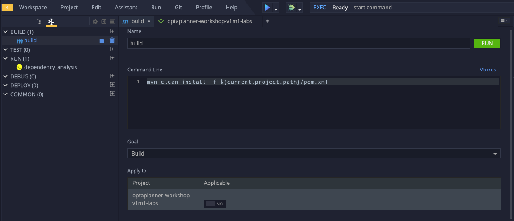
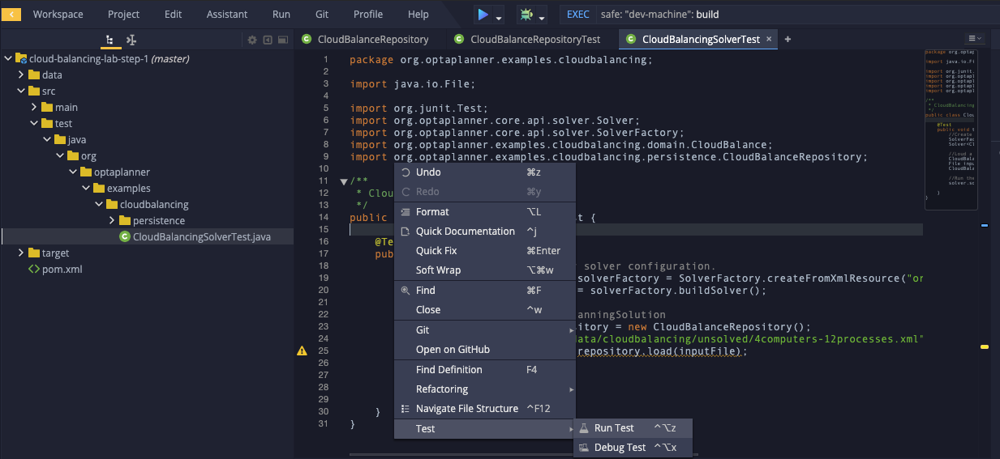

:scrollbar:
:data-uri:
:toc2:

= Red Hat Tech Exchange 2019: OptaPlanner 101 - Building your first optimization app using OptaPlanner's AI Constraint Solver

== Background

Almost every organization has to deal with planning problems to perform its business operations. Whether its transporting goods from a warehouse to stores, assigning employees to shifts, inspecting and servicing vehicles, or allocating tasks to departments, the more efficient and effective these tasks can be performed, the bigger the competitive advantage of an organization will be.

The aforementioned planning problems fall in a category of problems that are, in the academic world, known as NP-Complete and/or NP-Hard problems. What this in essence means is that there is no known algorith to solve these problems in polynomial time. Whenever the problem space of a problem grows, the time to find the solution to these problems grows exponentially.

As an example take the CloudBalance problem, in which computer processes/workloads need to be assigned to computers. For a problem in which we need to assign 300 processes to 100 computers, the amount of possible solutions is 100 ^ 300, which is equal to 10^600. Compare this to the number of atoms in the observable universe, which is 10^80, and one can see the vastness of the solution space of these kind of problems.

image::images/cloudBalanceSearchSpaceSize-2.png[]

In this lab you will be introduced to OptaPlanner/Business Optimizer, Red Hat’s A.I. Constraint Solver. OptaPlanner provides advanced A.I. heuristic algorithms that, combined with a domain model and constraint rules, allows organizations to find optimal solutions to their planning problems.

== Prerequisites

*Tools*

Most of the tools required will be provided in your by CodeReady WorkSpaces environment. The tools you need locally are:

* a browser (Chrome, Firefox)

*Skills*

* OpenShift Basics, familiarity with `oc` CLI tool and the OpenShift web console
* Familiarity with Unix command line and terminal based text editors
* Familiarity with IDEs, like Eclipse, IntelliJ.
* Java
* Maven

== Glossary

*OptaPlanner*: The open source AI Constraint Satisfaction Solver: https://www.optaplanner.org

*CodeReady Workspaces*: the cloud-native Integrated Development Environment on OpenShift.: https://developers.redhat.com/products/codeready-workspaces/overview

== Goals and learning objectives

* Understand what planning problems are.
* Understand how OptaPlanner can provide optimal solutions to these kind of problems using advanced A/I Heuristic Algorithms.
* Develop an OptaPlanner domain model for the _CloudBalancing_ problem.
* Write constraint rules for the _CloudBalancing_ problem.

== What is a Planning Problem?

A planning problem is a problem in which you want to:
* Optimize *Goals*
* With limited *Resources*
* Under *Constraints*

Examples of known planning problems are:
* Vehicle Routing (VRP)
* Shift Assignment
* Employee Rostering
* Conference Scheduling
* Hospital Bed Planning
* Exam Scheduling

In all of these examples, there is a certain goal, e.g. reduce fuel cost. There are resources, e.g. vehicles. And there are constraints, e.g. the maximum vehicle capacity. OptaPlanner takes all these facts into account and will use A/I heuritics algorithms to find the optimal solution to such a given problem.
Constraints, their level and their weights can be easily altered, allowing the user full flexibility on what he/she wants to optimize on. For example, purely optimizing on costs can have negative downsides on other areas, like employee well-being or CO2 emissions.

== Use Case

The use case for this lab is the _CloudBalancing_ problem. The _CloudBalancing_ problem is a problem in which we need to assign computer _processes/workloads_ to a set of _computers_.

image::images/cloudBalanceUseCase.png[]


== Architecture

OptaPlanner is a lightweight Java library, and as such can be deployed on, and integrated with, virtually any environment.

image::images/integrationOverview.png[]

OptaPlanner solutions can be run on premise and in the cloud, as nightly (batch) planning engine, as well as realtime planning engine.
This flexibility allows users to architect, design and implement an OptaPlanner solution specifically for their problem, their needs and their environment.

As OptaPlanner is a Java-based platform, OptaPlanner solutions are build in Java. This means that the problem's domain model can be defined and written as simple PoJo, and constraint rules can be written in either Java or in Drools, the open-source business rules engine.

In this lab we will simply use OptaPlanner as library runnning in our IDE. Data will be loaded from, and written to, a spreadsheet (Excel). We will build and run the planning engine from our IDE.


== Lab Material

The lab material is hosted on GitHub, at the following URL:

`https://github.com/rhte2019-optaplanner`

The material consists of a number of git repositories:

* *cloud-balancing-lab-step-1*
* *cloud-balancing-lab-step-2*
* *cloud-balancing-lab-step-3*

These Git repositories represent different stages within the lab. As we you only have 120 minutes to finnish the lab, some parts of the application have already been pre-defined for you in each step.


== Code Walkthrough

Given the limited time we have for this lab, we will provide you with the full domain model of our _CloudBalance_ problem. Your tasks will be to:

* annotate the domain model with the correct OptaPlanner annotations that instruct the engine which roles the specific classes of our domain play in our solution.
* write the logic to load the problem data and start the OptaPlanner planning engine.
* write the constraints of the solution that instruct OptaPlanner on what to optimize.

The class diagram of our _CloudBalance_ problem domain looks as follows:

image::images/cloudBalanceClassDiagram_1.png[]

There are 2 classes:
* Process: the computer process/workload to run
* Computer: the computer on which to run the process

A _Process_ has requirements in terms of required resources:
* Computer
* Memory
* Network Bandwidth


A _Computer_ provides a certain amount of resources (CPU, Memory, Network Bandwidth) and has a certain cost.

The goal is to create a planning solution that places processes on computers in such a way that:
* Computers do not get overloaded. I.e. the amount of resources required by the _Processes_ placed on the _Computer_ does not exceed the available resources of the _Computer_.
* Minimize the total cost of the required computers.


NOTE: Bla Bla

WARNING: In the OpenShift lab environment, which has limited resources, the login to jenkins might take a while and can eventually time out. If this is the case, you can skip the next step and safely continue with the remainder of the lab - the deployment of the application services.

This is nice as well:

----
this is nice as well <1>
----
<1> see how nice that is!!

== OpenShift Environment

An shared Openshift environment is provided. In this OpenShift environment we have deployed a _CodeReady Workspaces_ environment: A collaborative Kubernetes-native development solution that delivers OpenShift workspaces and in-browser IDE for rapid cloud application development.

Details about the environment are obtained through the Red Hat Summit _GuidGrabber_.

. In a browser window, navigate to http://bit.ly/summit-guidgrabber.
+
image::images/guid_grabber_landing_page_summit.png[]
. From this page select the Lab Code : `TA39DD: Next-Gen Process Management: a microservices approach to business automation`
. Enter the *Activation Key*: `nextgenprocessmanagement`.
. Enter your email address.
. Click `Submit`.
. The resulting page will display your lab’s GUID and other useful information about your lab environment. +
+
image::images/guid_grabber_details_page_2.png[]

. When you are completely done with your lab environment, please click `Reset Workstation` so that you can move on to the next lab. If you fail to do this, you will be locked into the GUID from the previous lab.
+
NOTE: Clicking Reset Workstation will not stop or delete the lab environment.

To log in into the OpenShift console:

* Navigate to the URL `https://master00-<GUID>.generic.opentlc.com` - replace `<GUID>` with the lab GUID from the GuidGrabber tool.
* Login with username `user1` and the password mentioned in the GuidGrabber tool.
* Your OpenShift cluster uses self-signed certificates, so expect a security warning in the browser. Create a security exception and proceed.


== CodeReady WorkSpaces

Red Hat CodeReady Workspaces is a developer workspace server and cloud IDE. Workspaces are defined as project code files and all of their dependencies neccessary to edit, build, run, and debug them. Each workspace has its own private IDE hosted within it. The IDE is accessible through a browser. The browser downloads the IDE as a single-page web application.

Red Hat CodeReady Workspaces provides:

- Workspaces that include runtimes and IDEs
- RESTful workspace server
- A browser-based IDE
- Plugins for languages, framework, and tools
- An SDK for creating plugins and assemblies


## Accessing CodeReady Workspaces

A CodeReady Workspaces environment has been created for every workshop user. To access your environment, use the link that is provided to you by your lab instructor. You can login with the OpenShift username and password that have been provided to you.

- In the CodeReady Workspaces login screen, click on "Openshift v3" on the right part of the form. You will be redirected to the OpenShift login screen.
    image:images/codeready-login-openshift.png[]
- Login with the workshop credentials that have been provided to you.
- An _Authorize Access_ screen will be presented. Leave `user_full` checkbox checked and click on `Allow selected permissions`.
    image:images/codeready-authorize-access.png[]
- In the next screen, provide additional user information. This can be dummy information for this workshop.
    images:image/codeready-user-information.png[]

CodeReady Workspaces will open and show the initial screen.

image:images:codeready-initial-screen.png[]


### Importing the Project

We will now import the base project, which already includes the solution's domain classed, into CodeReady. CodeReady allows us to directly import existing projects from GitHub.

In the initial screen, the `New Workspace` screen, that the platform provides us, we can import a new project.

1. Provide a name for your workspace, postfixed by your username. E.g, `cloud-balancing-user1` if you're username is `user1`.
2. Select the _stack_. In this case we select `Java 1.8`.
3. Set the RAM (memory) of the `dev-machine` to 2GB (default value).
4. Click on `Create and Open` button to create the workspace.
    
5. When the workspace has been created, click on `Import Project`.
    
6. In the _Import Project_ window, select `GITHUB` as the _Version Control System_, set the URL to `https://github.com/rhte2019-optaplanner/cloud-balancing-lab-step-1` and click on the _Import_ button.
    
7. In the _Project Configuration_ screen, select `Maven` and click the _Save_ button.

Our imported project is our base _Cloud Balancing_ project. It contains:

* the Maven POM file with all required dependencies.
* the domain model of our Cloud Balancing solver application.
* an empty `ScoreCalculator`. This component is responsible for calculating the _score_ of the solution.
* a _repository_ class responsible for loading the problem data from the filesystem
* a _data_ directory with 2 unsolved problems.
* two unit-tests: one test that runs the OptaPlanner `Solver` with on the unsolved problems as input, and one test that tests the `CloudBalanceRepository`.

### Compiling the project

To make sure our project for Lab1 is properly imported and configured, we will first run a Maven build. To do this, we need to access the CodeReady commands as show in the image below:



In the commands section, expand the _Build_ section, click on `build`, and in the main window of the IDE, click on the green `RUN` button.



A build will run and the output will be displayed in the console at the bottom of the screen. If the build succeeded, the following message will be displayed:
```
[INFO] ------------------------------------------------------------------------
[INFO] BUILD SUCCESS
[INFO] ------------------------------------------------------------------------
[INFO] Total time: 9.697 s
[INFO] Finished at: 2019-07-02T14:19:06Z
[INFO] ------------------------------------------------------------------------
```


=== Domain Model

You have been provided with the domain model. This domain model consists of 3 classes:

* `CloudProcess`: the process that needs to be assigned to a computer.
* `CloudComputer`: the computer to which to assign the processes.
* `CloudBalance`: this class holds the Cloud Balancing problem and solution, as well as the score of the solution.

The `CloudBalance` class is the class in which we will load the initial problem. This means that this class holds a `Collection` of `CloudProcess` and a `Collection` of `CloudComputer`.
While solving the problem, OptaPlanner creates a lot of different solutions, and for each solution it calculates a _score_. This score is also kept in the `CloudBalance` class.
When OptaPlanner finds a solution with a better score than the current best score, this solution is cloned and kept in a cloned instance of our `CloudBalance` class.

Although we've given you the basic domain model, the model is not yet complete and cannot yet be used by OptaPlanner. This is due to the fact that OptaPlanner is not aware yet of the roles that each class plays. We need to provide this information to OptaPlanner by annotating our domain model with OptaPlanner annotations.

To demonstrate this, we need to enable the unit-test found in class `org.optaplanner.examples.cloudbalancing.persistence.CloudBalancingSolverTest`. This class can be found in the `src/test/java` folder.

. Open the class `CloudBalancingSolverTest`.
. Uncomment the `@Test` annotation on the `testCloudBalance` method.
+
image:images/cloud-balancing-solver-test.png[]
+
. Right-click anywhere in the test class to open a contextual menu. Click on _Test -> Run Test_.


The test will fail with the following exception:

----
The scanAnnotatedClasses (ScanAnnotatedClassesConfig()) did not find any classes with a PlanningSolution annotation.
Maybe you forgot to annotate a class with a PlanningSolution annotation.
----

=== OptaPlanner Annotations

Before we can annotate our domain model, we need to understand a number of basic OptaPlanner concepts and annotations.

For OptaPlanner to be able to solve a problem, it basically needs to know 3 things about your planning problem:

* What are the _Planning Entities_: A planning entity is a JavaBean (POJO) that changes during solving. For example, a Process that gets assigned to different computers, or a ShiftAssignment that gets assigned to employees.
* What are the _Planning Variables_: a variable (or property, or attribute) of a PlannningEntity. This is the property that OptaPlanner can ‘play with’ during planning. For example the computer property of a Process, or the employee and shift of a ShiftAssignment.
* What is the _PlanningSolution_: A dataset for a planning problem needs to be wrapped in a class OptaPlanner to solve. The solution class represents both the planning problem and (if solved) a solution. The PlanningSolution also holds the score of the solution.

The error we got when running our test stated that OptaPlanner could not find a class with a `@PlanningSolution` annotation. In our domain model, the `CloudBalance` class is the class that holds the planning problem, hence, this is our `PlanningSolution` class.

. Open the `CloudBalance` class. It can be found in the `src/main/java` folder, in the package `org.optaplanner.examples.cloudbalancing.domain`.
. Add the `@PlanningAnnotation` to the class.
+
----
@PlanningSolution
@XStreamAlias("CloudBalance")
public class CloudBalance extends AbstractPersistable {
----
+
. Save the file.
. Run the `CloudBalancingSolverTest` unit-test class.

We have instructed OptaPlanner which class in our domain is our `PlanningSolution` class. When we look at the output of our unit-test, we will now see a different exception:

----
java.lang.IllegalStateException: The scanAnnotatedClasses (ScanAnnotatedClassesConfig()) did not find any classes with a PlanningEntity annotation.
----

As we can see, we need to instruct OptaPlanner which of our classes is our `PlanningEntity`. The `PlanningEntity` is the object that changes during solving. A common practice when defining an OptaPlanner domain model is to look at the relationships between classes (and hence, it's always a good practive to draw a UML diagram of your problem domain).
The `PlanningEntity` and `PlanningVariable` always have a relationship with each other, as the `PlanningVariable` is a property, or attribute of the PlanningEntity. This relationship is (usually) a _one-to-many_ relationship.
Within such a relationship, the `PlanningEntity` is the _many_-side of the relationship and the `PlanningVariable` is the _one_-side.

In our domain model, we can see that a process can be assigned to one computer, but a computer can host many processes. Hence, the `PlanningEntity` in our application is the `CloudProcess`, as shown in the diagram below:

image:images/cloudBalanceClassDiagram_2.png[]

. Open the `CloudProcess` class. It can be found in the `src/main/java` folder, in the package `org.optaplanner.examples.cloudbalancing.domain`.
. Add the `@PlanningEntity` annotation to the class
+
----
@PlanningEntity
@XStreamAlias("CloudProcess")
public class CloudProcess extends AbstractPersistable {
----
+
. Save the file.
. Run the `CloudBalancingSolverTest` unit-test class.

The new output of our test is:

----
java.lang.IllegalStateException: The solutionClass (class org.optaplanner.examples.cloudbalancing.domain.CloudBalance) must have at least 1 member with a PlanningEntityCollectionProperty annotation or a PlanningEntityProperty annotation.

----

We need to instruct OptaPlanner where it can find the collection of PlanningEnities (in our case a collection of `CloudProcess`) which it needs to plan.
Our `PlanningSolution` class, `CloudBalance`, is the class that contains our problem (and will hold our solution after planning), hence, we need to annotate the _getter_ method in our `CloudBalance` class that returns a `Collection<CloudProcess`.

. Open the `CloudBalance` class.
. Locate the method `getProcessList()`
. Annotate the method with `@PlanningEnitityCollectionProperty`.
+
----
@PlanningEntityCollectionProperty
public List<CloudProcess> getProcessList() {
----
+
. Save the file.
. Run the `CloudBalancingSolverTest` unit-test class.

The output shows:

----
The solutionClass (class org.optaplanner.examples.cloudbalancing.domain.CloudBalance) must have 1 member with a PlanningScore annotation. Maybe add a getScore() method with a PlanningScore annotation.
----

We need to tell OptaPlanner which field of the `PlanningSolution` class will contain the score of the solutions.

. Open the `CloudBalance` class.
. Locate the method `getScore()`
. Annotate the method with `@PlanningScore`.
+
----
@PlanningScore
public HardSoftScore getScore() {
----
+
. Save the file.
. Run the `CloudBalancingSolverTest` unit-test class.

The output shows:

----
The entityClass (class org.optaplanner.examples.cloudbalancing.domain.CloudProcess) should have at least 1 getter method or 1 field with a PlanningVariable annotation or a shadow variable annotation.
----

This indicates that we need to instruct OptaPlanner what the `PlanningVariable` is in our domain. As we've seen earlier in our class diagram, the `PlanningVariable` is the _one_-side of our _many-to-one_ relationship. Hence, our `PlanningVariable`, the variable that OptaPlanner can _play with_, is the `computer` attribute of our `CloudProcess` class.

. Open the `CloudProcess` class.
. Locate the method `getComputer()`.
. Annotate the method with the `@PlanningVariable` annotation.
+
----
@PlanningVariable
public CloudComputer getComputer() {
----
+
. Save the file.
. Run the `CloudBalancingSolverTest` unit-test class.

----
The entityClass (class org.optaplanner.examples.cloudbalancing.domain.CloudProcess) has a PlanningVariable annotated property (computer) that has no valueRangeProviderRefs ([]).
----

The final piece of the puzzle is to instruct OptaPlanner where it can find the range of value for our `PlanningVariable`. This is done through a so called `ValueRangeProvider`. As with the `PlanningEntity`, the range of values for our `PlanningVariable` is going to be configured on our `PlanningSolution` class (note that this is not the only option, _ValueRangeProviders_ can also be defined on the `PlanningEntity` class in certain cases).
Apart from specifying the `ValueRangeProvider` in the `PlanningSolution` class, we need to also specify the reference to this `ValueRanegProvider` in the `@PlanningVariable` annotation of our `PlanningEntity` class. This is needed because problem domains can have more than one `PlanningVariable`.

. Open the `CloudBalance` class.
. Locate the method `getComputerList()`.
. Annotate the method with the `@ValueRangeProvider(id = "computerRange")`.
+
----
@ValueRangeProvider(id = "computerRange")
public List<CloudComputer> getComputerList() {
----
+
. Save the file.
. Next, open the `CloudProces` class.
. Add the `valueRangeProviderRefs` attibute to the `PlanningVariable` annotation to reference the `computerRange` `ValueRangeProvider`.
+
----
@PlanningVariable(valueRangeProviderRefs = {"computerRange"})
public CloudComputer getComputer() {
----
+
. Save the file.
. Run the `CloudBalancingSolverTest` unit-test class.


We can now see the test completing successfully.

We have successfully imported and configured our domain model. However, we have not yet implemented our constraints that define the score of our solutions.
When we look at the output log lines of our test, we see:

----
2019-08-16 13:26:02,754 [INFO] [main] [org.optaplanner.core.impl.solver.DefaultSolver] INFO  Solving ended: time spent (5000), best score (0hard/0soft), score calculation speed (5878/sec), phase total (2), environment mode (REPRODUCIBLE).
----

We see that the score is *(0hard/0soft)*. This is due to the fact that the imported project has a _skeleton_ `ScoreCalculator` defined.

. Open the class `CloudBalancingEasyScoreCalculator`.It can be found in the `src/main/java` folder, in the package `org.optaplanner.examples.cloudbalancing.optional.score`.
. Inspect the method `calculateScore`.

As you can see, we simply return a _0hard/0soft_ score for every invocation. In the next section we will implement the constrains of our application.

=== The Score

OptaPlanner uses the _Score_ of a solution to determine whether a certain solution is better or worse than another solution.
OptaPlanner provides different types of scores and scorelevels. Examples of different scores are:

* `SimpleScore`: defines a single score level.
* `HardSoftScore`: a score with 2 levels, a _hard_ score and a _soft_ score.
* `HardMediumSoftScore`: a score with 3 levles, _hard_, _medium_, and _soft_.
* `BendableScore`: a score with _n_-levels of constraints.

Apart from the default score classes where the score is defined as an integer, there is also support for scores of different types, e.g. `HardSoftBigDecimalScore`, `HardMediumSoftLongScore`, etc.

Depending on the type of solver you're building, you can have different requirements for a score.

In this lab we will use a `HardSoftScore`. In this score:

* hard constraints define constraints that must not be broken. A solution with broken hard-constraints is regarded as an _infeasible_ solution, and is therefore useless. An example of a hard constraint in our _Cloud Balancing_ example is the constraint that a computer should not be overloaded. I.e. the resource requirements of the processes deployed on a computer should not exceed the resources provided by the computer.
* soft constraints define constraints that OptaPlanner must optimize on. For example, in our _Cloud Balancing_ example, the total costs of the computers required to run our processes should be as low as possible.

When comparing scores of solutions that have multiple score levels, the scores are compared from the highest score level to the lowest. E.g. in a HardSoftScore, the hard-scores are compared, and after that the soft-scores, as illustrated below:

image:images/scoreComparisonCloudBalancing.png[]

In an OptaPlanner solution, the `ScoreCalculator` is responsible for calculating the score of a solution. OptaPlanner supports multiple `ScoreCalculator` implemetations:

* _Easy Java score calculation_: Implement all constraints together in a single method in Java (or another JVM language). Does not scale.
* _Incremental Java score calculation_ (*not recommended*): Implement multiple low-level methods in Java (or another JVM language). Fast and scalable. Very difficult to implement and maintain.
* _Drools score calculation_: Implement each constraint as a separate score rule in DRL. Scalable.

The most common implementation of the `ScoreCalculator` and constraint rules is _Drools_, for the reason that constraint rules are relatively easy to implement, as well as the native _incremental score calculation_ semantics that Drools provides, which is important for performance, and therefore solution quality and scalability reasons. Hence, we will write our constraint rules in Drools.

. in 
