:scrollbar:
:data-uri:
:toc2:

= OptaPlanner 101 - Building your first optimization app using OptaPlanner's AI Constraint Solver

== Background

Almost every organization has to deal with planning problems to perform its business operations. Whether its transporting goods from a warehouse to stores, assigning employees to shifts, inspecting and servicing vehicles, or allocating tasks to departments, the more efficient and effective these tasks can be performed, the bigger the competitive advantage of an organization will be.

The aforementioned planning problems fall in a category of problems that are, in the academic world, known as NP-Complete problems. What this in essence means is that there is no known algorithm to solve these problems in polynomial time. Whenever the problem space of a problem grows, the time to find the solution to these problems grows exponentially.

As an example take the _Cloud Balancing_ problem, in which computer processes/workloads need to be assigned to computers. For a problem in which we need to assign 300 processes to 100 computers, the number of possible solutions is 100 ^ 300, which is equal to 10^600. Compare this to the number of atoms in the observable universe, which is 10^80, and one can easily see the vastness of the solution space of these kind of problems.

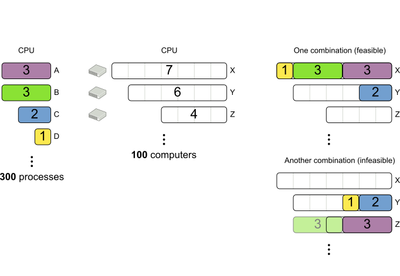

In this lab you will be introduced to OptaPlanner/Business Optimizer, Red Hat’s A.I. Constraint Solver. OptaPlanner provides advanced A.I. heuristic algorithms that, combined with a domain model and constraint rules, allows organizations to find optimal solutions to their planning problems.

== Prerequisites

*Tools*

Most of the tools required will be provided in your by CodeReady Workspaces environment. The tools you need locally are:

* a browser (Chrome, Firefox)

*Skills*

* Familiarity with IDEs, like Eclipse, IntelliJ, Visual Studio Code, CodeReady Workspaces.
* Java
* Maven

NOTE: This lab can also be done in your own IDE of choice (Eclipse, IntelliJ, VSCode) on your own machine, as long as you have JDK 8 and Maven installed. There is no dependency on CodeReady Workspaces and/or OpenShift. All lab materials are provided as standard Maven projects on GitHub.

== Glossary

*OptaPlanner*: The open source AI Constraint Solver: https://www.optaplanner.org

*CodeReady Workspaces*: the cloud-native Integrated Development Environment on OpenShift.: https://developers.redhat.com/products/codeready-workspaces/overview

== Goals and learning objectives

* Understand what planning problems are.
* Understand how OptaPlanner can provide optimal solutions to these kind of problems using advanced A.I. Heuristic Algorithms.
* Annotate an OptaPlanner domain model for the _Cloud Balancing_ problem.
* Write constraint rules for the _Cloud Balancing_ problem.
* Understand the OptaPlanner API.
* Optional: learn how to use the OptaPlanner Benchmarker.


== What is a Planning Problem?

A planning problem is a problem in which you want to:


Examples of known planning problems are:

* Vehicle Routing (VRP)
* Shift Assignment
* Employee Rostering
* Conference Scheduling
* Hospital Bed Planning
* Exam Scheduling

In all of these examples, there is a certain goal, e.g. "reduce fuel costs". There are resources, e.g. "vehicles". And there are constraints, e.g. "the maximum vehicle capacity".

OptaPlanner takes all these facts into account and will use A.I. heuritics algorithms to find the optimal solution to a given problem.
Constraints, their level, and their weights, can be easily altered, giving the user full flexibility on what he/she wants to optimize on. For example, purely optimizing on costs can have negative consequences in other areas, like employee well-being or CO2 emissions. By providing the ability to users to configure the area in which they want to optimize, OptaPlanner gives users full flexibility and control over their use-case.

== Use Case

The use case for this lab is the _Cloud Balancing_ problem. The _Cloud Balancing_ problem is a problem in which we need to assign computer _processes/workloads_ to a set of _computers_.

image::images/cloudBalanceUseCase.png[]


== Architecture

OptaPlanner is a lightweight Java library, and as such can be deployed on, and integrated with, virtually any environment.

image::images/integrationOverview.png[]

OptaPlanner solutions can be run on premise and in the cloud, as nightly (batch) planning engine, as well as realtime planning engine.
This flexibility allows users to architect, design and implement an OptaPlanner solution specifically for their problem, their needs and their environment.

As OptaPlanner is a Java-based platform, OptaPlanner solutions are, obviously, built in Java. This means that the problem's _domain model_ can be defined and written as simple PoJo, and constraint rules can be written in either Java or in Drools, the open-source business rules engine.

In this lab we will simply use OptaPlanner as a library runnning in our IDE. Data will be loaded from, and written to, an XML file. We will build and run the planning engine from our IDE.


== Lab Material

The lab material is hosted on GitHub, at the following URL:

`https://github.com/rhte2019-optaplanner`

The material consists of a number of git repositories:

* *cloud-balancing-lab-step-1*: https://github.com/rhte2019-optaplanner/cloud-balancing-lab-step-1
* *cloud-balancing-lab-step-2*: https://github.com/rhte2019-optaplanner/cloud-balancing-lab-step-2

These Git repositories represent different stages within the lab. The scheduled time for this lab is 120 minutes and therefore some parts of the application have already been pre-defined for you.


== Code Walkthrough

Given the limited amount of time we have for this lab, we provide you with the full domain model of the _Cloud Balancing_ problem. Your tasks are to:

* annotate the domain model with the correct OptaPlanner annotations that instruct the engine which roles the specific classes of our model play in our solution.
* write the constraint rules of the solution that instruct OptaPlanner on what to optimize.
* optional: create an OptaPlanner Benchmarker.

The class diagram of our _Cloud Balance_ problem domain looks as follows:

image::images/cloudBalanceClassDiagram_1.png[]

There are 2 classes:

* `Process`: the computer process/workload to run.
* `Computer`: the computer on which to run the process.

A _Process_ has requirements in terms of required resources:

* Computer
* Memory
* Network Bandwidth


A _Computer_ provides a certain amount of resources (CPU, Memory, Network Bandwidth) and has a certain cost.

The goal is to create a planning solution that places _processes_ on _computers_ in such a way that:

* Computers do not get overloaded. I.e. the amount of resources required by the processes placed on the computer does not exceed the available resources of the computer.
* Minimize the total cost of the required computers.


== OpenShift Environment

A shared Openshift environment is provided. In this OpenShift environment we have deployed a _CodeReady Workspaces_ environment: a collaborative Kubernetes-native development solution that delivers OpenShift workspaces and in-browser IDE for rapid cloud application development.

Details about the environment are obtained through the Red Hat _GuidGrabber_.

. In a browser window, navigate to the _GuidGrabber_ address provided by your instructor.
+
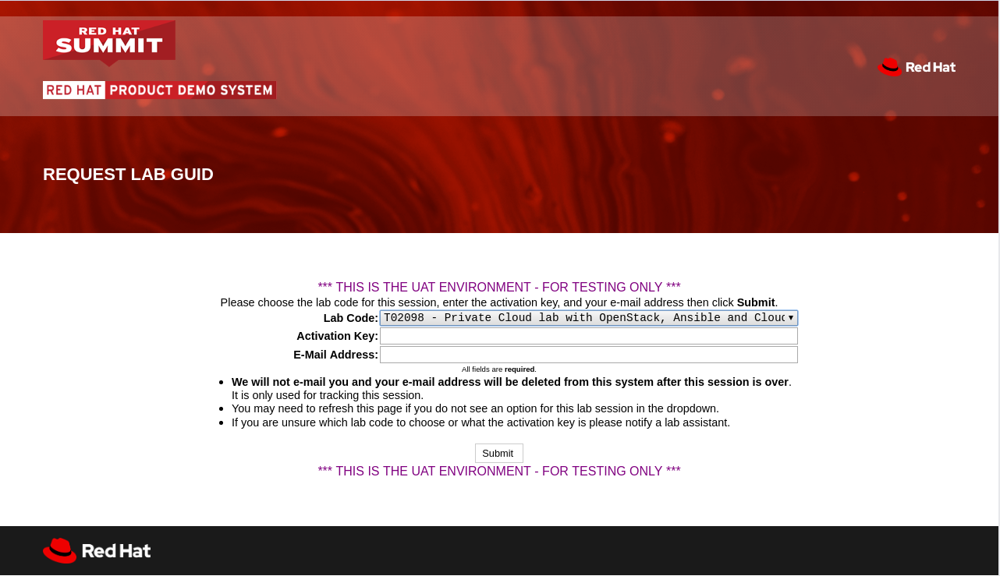
. From this page select the Lab Code provided by your instructor.
. Enter the *Activation Key* provided by your instructor.
. Enter your email address.
. Click `Submit`.
. The resulting page will display your lab’s GUID and other useful information about your lab environment. +
+
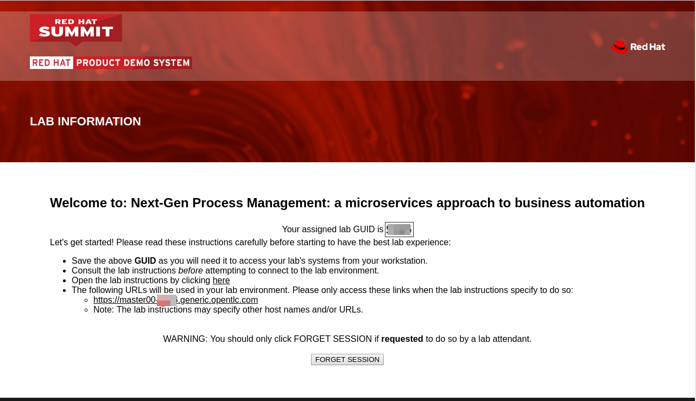

To log in into the CodeReady Workspaces console:

* Navigate to the CodeReady Workspaces environment via the link provided in your _GuidGrabber_ screen.

== CodeReady WorkSpaces

Red Hat CodeReady Workspaces is a developer workspace server and cloud IDE. Workspaces are defined as project code files and all of their dependencies neccessary to edit, build, run, and debug them. Each workspace has its own private IDE hosted within it. The IDE is accessible through a browser. The browser downloads the IDE as a single-page web application.

Red Hat CodeReady Workspaces provides:

- Workspaces that include runtimes and IDEs
- RESTful workspace server
- A browser-based IDE
- Plugins for languages, framework, and tools
- An SDK for creating plugins and assemblies

NOTE: The CodeReady Workspaces environment has been provisioned for you so that can run the labs in a pre-provisioned environment. However, you can also run the labs on your own laptop, provided that you have an IDE, JDK 8+, Maven and Git tools installed. There is no dependency on CodeReady Workspaces and/or OpenShift. All lab materials are provided as standard Maven projects on GitHub.

## Accessing CodeReady Workspaces

A CodeReady Workspaces environment has been created for every workshop user. To access your environment, use the link that is provided to you by your lab instructor. You can login with the OpenShift username and password that have been provided to you.

- In the CodeReady Workspaces login screen, login with the workshop credentials that have been provided to you.
+
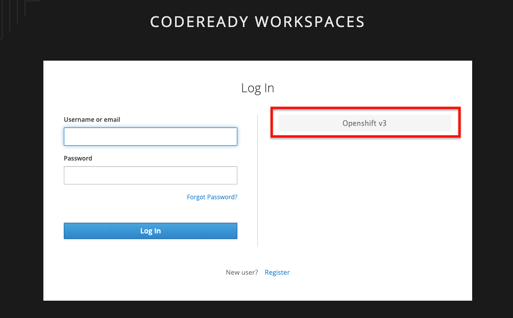
+
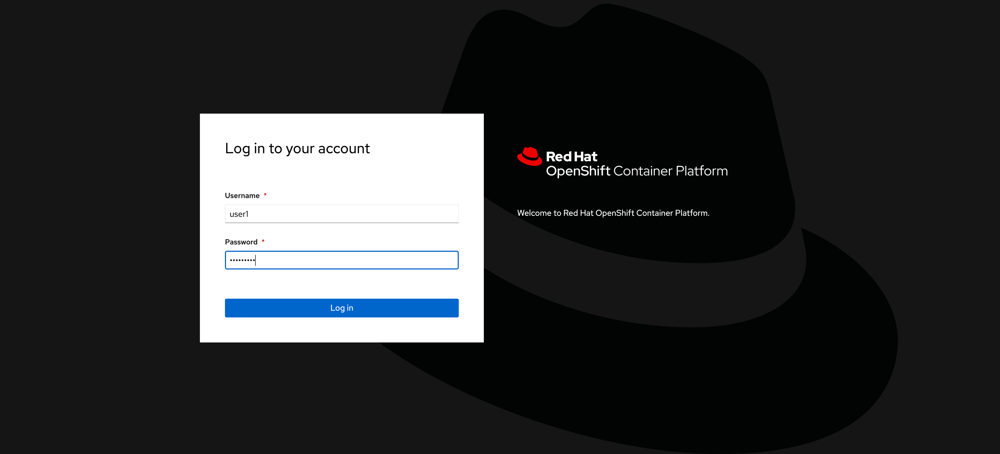
+
- An _Authorize Access_ screen will be presented. Leave `user_full` checkbox checked and click on `Allow selected permissions`.
    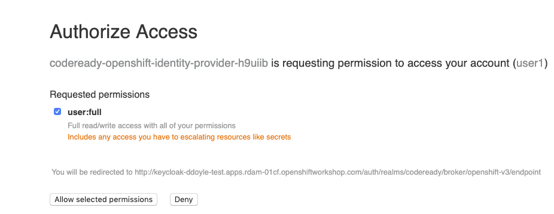
- In the next screen, provide additional user information. This can be dummy information for this workshop.
    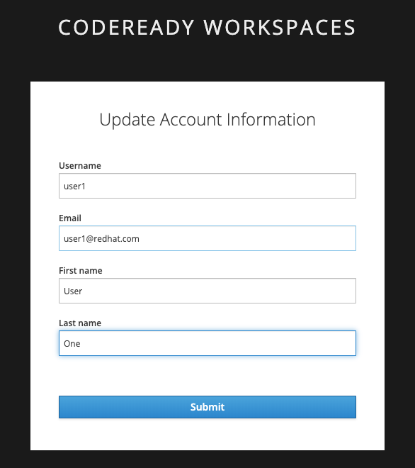

CodeReady Workspaces will open and show the initial screen.

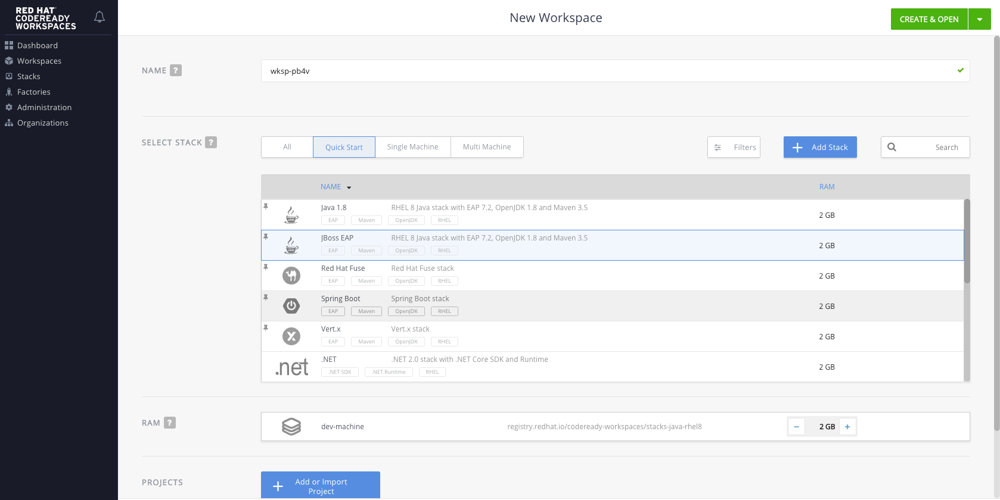

### Creating the Workspace

We will now create our workspace from a the `OptaPlanner Workshop` stack that we've provided in your CodeReady Workspaces environment.
This stack contains:
* OpenJDK 8
* Maven 3.5.x
* The OptaPlanner Cloud-Balancing lab repository
* Pre-defined Maven commands to build the project, run its unit-tests and run the OptaPlanner Benchmarker.

To create a new workspace, scroll down in the `Getting Started with CodeReady Workspaces` page until you see the `OptaPlanner Workshop` stack.
Select the stack and click on the green `CREATE & OPEN` button.

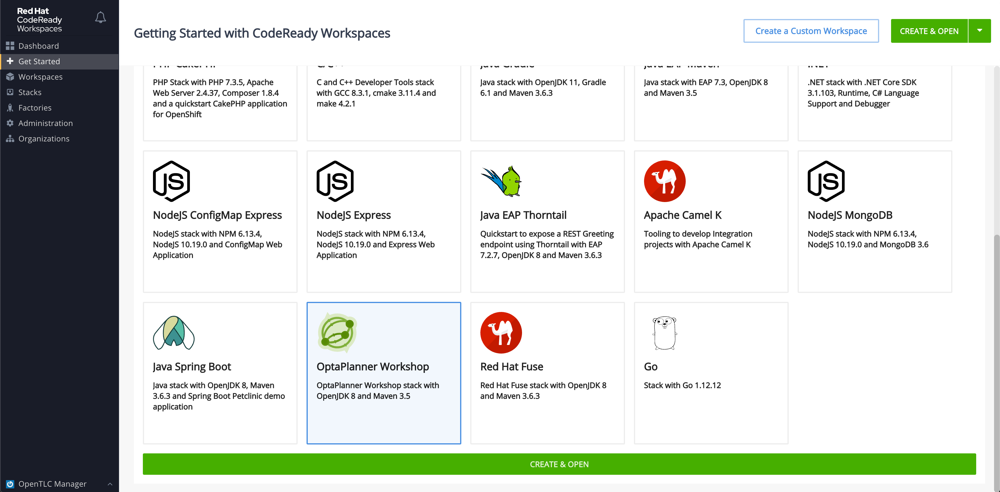


CodeReady Workspaces will create a new workspace container in our OpenShift instance. Note that creating the container can take some time. Wait for this process to finish.

The workspace automatically import the base project, which already includes the solution's domain classed, into CodeReady. This project is automatically imported from Github, as defined in our _devfile_.

When your environment is up and running, click on the _Explorer_ button in the upper left corner to open the project explorer.
Expand the `cloud-balancing-lab` and navigate the project structure.

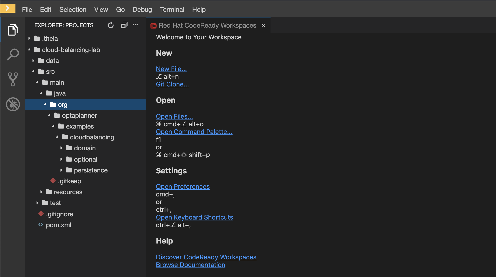

Our imported project is our base _Cloud Balancing_ project. It contains:

* the Maven POM file with all required dependencies.
* the domain model of our Cloud Balancing solver application.
* an empty `ScoreCalculator`. This component is responsible for calculating the _score_ of the solution.
* a _repository_ class responsible for loading the problem data from the filesystem
* a _data_ directory with 2 unsolved problems.
* a unit-tests that runs the OptaPlanner `Solver` with on the unsolved problems as input

### Compiling the project

To make sure our project for Lab1 is properly imported and configured, we will first run a Maven build.
To do this, we can run the Maven _Build_ command that is available in our workspace.
Click on the cube icon on the right hand side of the screen. Click on _User Runtimes -> maven -> Build_.
This will execute a `mvn clean install` command in a new terminal:

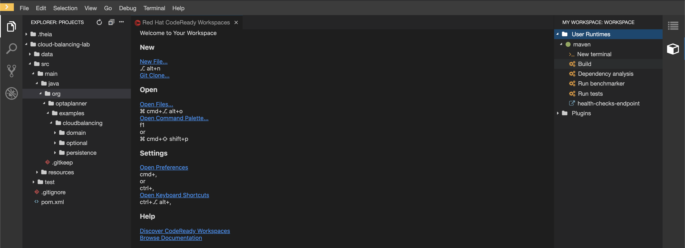

The build will start downloading the project's Maven dependencies and compile the project. After a while, the terminal will show that the build was successful.

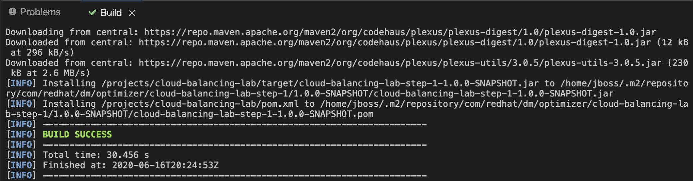

```
[INFO] ------------------------------------------------------------------------
[INFO] BUILD SUCCESS
[INFO] ------------------------------------------------------------------------
[INFO] Total time: 9.697 s
[INFO] Finished at: 2019-07-02T14:19:06Z
[INFO] ------------------------------------------------------------------------
```

=== Domain Model

You have been provided with the domain model of our _Cloud Balance_ problem. This domain model consists of 3 classes:

* `CloudProcess`: the process that needs to be assigned to a computer.
* `CloudComputer`: the computer to which to assign the processes.
* `CloudBalance`: this class holds the Cloud Balancing problem and solution, as well as the score of the solution.

The `CloudBalance` class is the class in which we will load the initial problem. This means that this class holds a `Collection` of `CloudProcess` and a `Collection` of `CloudComputer`.
While solving the problem, OptaPlanner creates a lot of different solutions, and for each solution it calculates a _score_. This _score_ is also kept in the `CloudBalance` class.
When OptaPlanner finds a solution with a better score than the current best score, this solution is cloned and kept in a cloned instance of our `CloudBalance` class.

Although we've given you the basic domain model, the model is not yet complete and cannot yet be used by OptaPlanner. This is due to the fact that OptaPlanner is not aware yet of the roles that each class plays. We need to provide this information, or meta-data, to OptaPlanner by annotating the domain model with OptaPlanner annotations.

To demonstrate this, we will run a unit-test that tests the OptaPlanner `Solver` with a provided data-set. We first need to enable the unit-test found in class `org.optaplanner.examples.cloudbalancing.persistence.CloudBalancingSolverTest`. This class can be found in the `src/test/java` folder.

. Open the `CloudBalancingSolverTest` class.
. Uncomment the `@Test` annotation on the `testSolver` method.
+
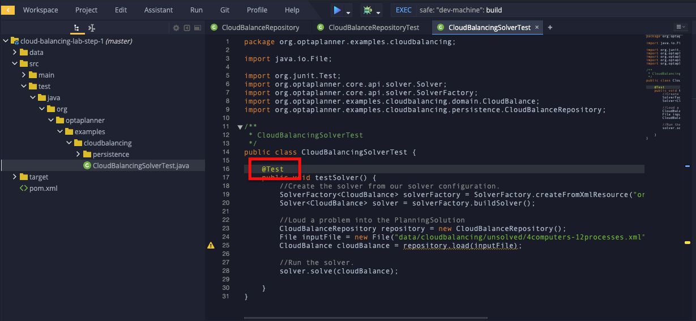
+
. Save the file (note that in CodeReady Workspaces, files are automatically saved).
. With the unit-test enabled, we can run the test by simply running the Maven build again. As we did previously, click on the Maven `Build` action on the right hand side of the screen.


The test (and build) will fail with the following exception:

----
java.lang.IllegalStateException: The scanAnnotatedClasses (ScanAnnotatedClassesConfig()) did not find any classes with a PlanningSolution annotation.
Maybe you forgot to annotate a class with a PlanningSolution annotation.
----

=== OptaPlanner Annotations

Before we can annotate our domain model, we need to understand a number of basic OptaPlanner concepts and annotations.

For OptaPlanner to be able to solve a problem, it basically needs to know 3 things about your planning problem:

* What are the _Planning Entities_: A planning entity is a JavaBean (POJO) that changes during solving. For example, a process that gets assigned to different computers, or a shift assignment that gets assigned to employees.
* What are the _Planning Variables_: a variable (or property, or attribute) of a `PlannningEntity`. This is the property that OptaPlanner can _play with_ during planning. For example the computer property of a process, or the employee and shift of a shift assignment.
* What is the _Planning Solution_: A data-set for a planning problem needs to be wrapped in a class for OptaPlanner to be able to solve. The solution class represents both the planning problem and (if solved) a solution. This `PlanningSolution` also holds the score of the solution.

The error we got when running our test stated that OptaPlanner could not find a class with a `@PlanningSolution` annotation. In our domain model, the `CloudBalance` class is the class that holds the planning problem, hence, this is our `PlanningSolution` class.

. Open the `CloudBalance` class. It can be found in the `src/main/java` folder, in the package `org.optaplanner.examples.cloudbalancing.domain`.
. Add the `@PlanningSolution` to the class.
+
----
@PlanningSolution
@XStreamAlias("CloudBalance")
public class CloudBalance extends AbstractPersistable {
----
+
. Save the file (note that in CodeReady Workspaces, files are automatically saved).
. Run the Maven build again to run the test.

We have instructed OptaPlanner which class in our domain is our `PlanningSolution` class. When we look at the output of our unit-test, we will now see a different exception:

----
java.lang.IllegalStateException: The scanAnnotatedClasses (ScanAnnotatedClassesConfig()) did not find any classes with a PlanningEntity annotation.
----

As we can see, we need to instruct OptaPlanner which of our classes is our `PlanningEntity`. The `PlanningEntity` is the object that changes during solving. A common practice when defining an OptaPlanner domain model is to look at the relationships between classes (and hence, it's always a good practive to draw a UML diagram of your problem domain).
The `PlanningEntity` and `PlanningVariable` always have a relationship with each other, as the `PlanningVariable` is a property, or attribute of the PlanningEntity. This relationship is (usually) a _one-to-many_ relationship.
Within such a relationship, the `PlanningEntity` is the _many_-side of the relationship and the `PlanningVariable` is the _one_-side.

In our domain model, we can see that a process can be assigned to one computer, but a computer can host many processes. Hence, the `PlanningEntity` in our application is the `CloudProcess`, as shown in the diagram below:

image:images/cloudBalanceClassDiagram_2.png[]

. Open the `CloudProcess` class. It can be found in the `src/main/java` folder, in the package `org.optaplanner.examples.cloudbalancing.domain`.
. Add the `@PlanningEntity` annotation to the class
+
----
@PlanningEntity
@XStreamAlias("CloudProcess")
public class CloudProcess extends AbstractPersistable {
----
+
. Save the file (note that in CodeReady Workspaces, files are automatically saved).
. Run the Maven build again to run the test.

The new output of our test is:

----
java.lang.IllegalStateException: The solutionClass (class org.optaplanner.examples.cloudbalancing.domain.CloudBalance) must have at least 1 member with a PlanningEntityCollectionProperty annotation or a PlanningEntityProperty annotation.

----

We need to instruct OptaPlanner where it can find the `Collection` of `PlanningEntity` (in our case a `Collection` of `CloudProcess`) which it needs to plan.
Our `PlanningSolution` class, `CloudBalance`, is the class that contains our problem (and will hold our solution after planning), hence, we need to annotate the _getter_ method in our `CloudBalance` class that returns a `Collection<CloudProcess`.

. Open the `CloudBalance` class.
. Locate the method `getProcessList()`
. Annotate the method with `@PlanningEntityCollectionProperty`.
+
----
@PlanningEntityCollectionProperty
public List<CloudProcess> getProcessList() {
----
+
. Save the file (note that in CodeReady Workspaces, files are automatically saved).
. Run the Maven build again to run the test.

The output shows:

----
The solutionClass (class org.optaplanner.examples.cloudbalancing.domain.CloudBalance) must have 1 member with a PlanningScore annotation. Maybe add a getScore() method with a PlanningScore annotation.
----

We need to tell OptaPlanner which field of the `PlanningSolution` class will contain the score of the solutions.

. Open the `CloudBalance` class.
. Locate the method `getScore()`
. Annotate the method with `@PlanningScore`.
+
----
@PlanningScore
public HardSoftScore getScore() {
----
+
. Save the file (note that in CodeReady Workspaces, files are automatically saved).
. Run the Maven build again to run the test.

The output shows:

----
The entityClass (class org.optaplanner.examples.cloudbalancing.domain.CloudProcess) should have at least 1 getter method or 1 field with a PlanningVariable annotation or a shadow variable annotation.
----

This indicates that we need to instruct OptaPlanner what the `PlanningVariable` is in our domain. As we've seen earlier in our class diagram, the `PlanningVariable` is the _one_-side of our _many-to-one_ relationship. Hence, our `PlanningVariable`, the variable that OptaPlanner can _play with_, is the `computer` attribute of our `CloudProcess` class.

. Open the `CloudProcess` class.
. Locate the method `getComputer()`.
. Annotate the method with the `@PlanningVariable` annotation.
+
----
@PlanningVariable
public CloudComputer getComputer() {
----
+
. Save the file (note that in CodeReady Workspaces, files are automatically saved).
. Run the Maven build again to run the test.

The output is:

----
The entityClass (class org.optaplanner.examples.cloudbalancing.domain.CloudProcess) has a PlanningVariable annotated property (computer) that has no valueRangeProviderRefs ([]).
----

The final piece of the puzzle is to instruct OptaPlanner where it can find the range of values of our `PlanningVariable`. This is done through a so called `ValueRangeProvider`. As with the `PlanningEntity`, the range of values of our `PlanningVariable` is going to be configured on our `PlanningSolution` class (note that this is not the only option, _ValueRangeProviders_ can also be defined on the `PlanningEntity` class in certain cases).
Apart from specifying the `ValueRangeProvider` in the `PlanningSolution` class, we need to also specify the reference to this `ValueRanegProvider` in the `@PlanningVariable` annotation of our `PlanningEntity` class. This is needed because problem domains can have more than one `PlanningVariable`.

. Open the `CloudBalance` class.
. Locate the method `getComputerList()`.
. Annotate the method with the `@ValueRangeProvider(id = "computerRange")`.
+
----
@ValueRangeProvider(id = "computerRange")
public List<CloudComputer> getComputerList() {
----
+
. Save the file (note that in CodeReady Workspaces, files are automatically saved).
. Next, open the `CloudProcess` class.
. Add the `valueRangeProviderRefs` attribute to the `@PlanningVariable` annotation to reference the `computerRange` `ValueRangeProvider`.
+
----
@PlanningVariable(valueRangeProviderRefs = {"computerRange"})
public CloudComputer getComputer() {
----
+
. Save the file (note that in CodeReady Workspaces, files are automatically saved).
. Run the Maven build again to run the test.


We can now see the test completing successfully.

We have successfully imported and configured our domain model. However, we have not yet implemented the constraints that define the score of our solutions.
When we look at the output log lines of our test, we see:

----
2019-08-16 13:26:02,754 [INFO] [main] [org.optaplanner.core.impl.solver.DefaultSolver] INFO  Solving ended: time spent (5000), best score (0hard/0soft), score calculation speed (5878/sec), phase total (2), environment mode (REPRODUCIBLE).
----

We see that the score is *(0hard/0soft)*. This is due to the fact that the imported project has a _skeleton_ `ScoreCalculator` defined.

. Open the class `CloudBalancingEasyScoreCalculator`.It can be found in the `src/main/java` folder, in the package `org.optaplanner.examples.cloudbalancing.optional.score`.
. Inspect the method `calculateScore`.

As you can see, we simply return a _0hard/0soft_ score for every invocation. In the next section we will implement the constrains of our planning problem.

=== The Score

OptaPlanner uses the _score_ of a solution to determine whether a certain solution is better or worse than another solution.
OptaPlanner provides different types of scores and score-levels. Examples of different scores are:

* `SimpleScore`: defines a single score level.
* `HardSoftScore`: a score with 2 levels, a _hard_ score and a _soft_ score.
* `HardMediumSoftScore`: a score with 3 levles, _hard_, _medium_, and _soft_.
* `BendableScore`: a score with _n_-levels of constraints.

Apart from the default score classes, in which the score is defined as an integer, there is also support for scores of different types, e.g. `HardSoftBigDecimalScore`, `HardMediumSoftLongScore`, etc.

Depending on the type of solver you're building, you can have different requirements for a score.

In this lab we will use a `HardSoftScore`. In this score:

* _hard constraints_ define constraints that must not be broken. A solution with broken hard-constraints is regarded as an _infeasible_ solution, and is therefore useless. An example of a hard constraint in our _Cloud Balancing_ example is the constraint that a computer should not be overloaded. I.e. the resource requirements of the processes deployed on a computer should not exceed the resources provided by the computer.
* _soft constraints_ define constraints that OptaPlanner must optimize on. For example, in our _Cloud Balancing_ example, the total costs of the computers required to run our processes should be as low as possible. The sum of the costs of all required computers is therefore a soft constraint

When comparing scores of solutions that have multiple score levels, the scores are compared from the highest score level to the lowest. E.g. in a HardSoftScore, first the hard-scores are compared, and after that the soft-scores, as illustrated below:

image:images/scoreComparisonCloudBalancing.png[]

In an OptaPlanner solution, the `ScoreCalculator` is responsible for calculating the score of a solution. OptaPlanner supports multiple `ScoreCalculator` implemetations:

* _Easy Java score calculation_: Implement all constraints together in a single method in Java (or another JVM language). Does not scale.
* _Incremental Java score calculation_ (*not recommended*): Implement multiple low-level methods in Java (or another JVM language). Fast and scalable. Very difficult to implement and maintain.
* _Drools score calculation_: Implement each constraint as a separate score rule in DRL. Scalable.

The most common implementation of the `ScoreCalculator` and constraint rules is _Drools_, for the reason that the native _incremental score calculation_ semantics of Drools implicitly provides performance and scalability. Hence, we will write our constraint rules in Drools.

If you've successfully completed the lab until now, and have a correctly annotated domain model, you can continue using the same project in your CodeReady Workspaces environment for this project. You can also import the project for this lab from this location: https://github.com/rhte2019-optaplanner/cloud-balancing-lab-step-2

. In the package `org.optaplanner.examples.cloudbalancing.solver` in the `src/main/resources` folder, add a new file with the name `cloudBalancingScoreRules.drl`.
. Add the following lines to the DRL file you've just created. This defines the package name of the file, the import of types requires in our score rules, and a global variable that references the `Score`.
+
----
package org.optaplanner.examples.cloudbalancing.solver;

import org.optaplanner.core.api.score.buildin.hardsoft.HardSoftScoreHolder;

import org.optaplanner.examples.cloudbalancing.domain.CloudBalance;
import org.optaplanner.examples.cloudbalancing.domain.CloudComputer;
import org.optaplanner.examples.cloudbalancing.domain.CloudProcess;

global HardSoftScoreHolder scoreHolder;
----
+
. Save the file (note that in CodeReady Workspaces, files are automatically saved).
. In the same folder, open the `cloudBalancingSolverConfig.xml` file. This file contains the configuration of our _Solver_, like:
    * the _scoreDirectorFactory_ to use (which defines which type of _score calculator_ is used).
    * the _termination configuration (which defines when OptaPlanner should stop the _Solver_).
    * the heuristic algorithms to use.
    * etc.
. Locate the `scoreDirectorFactory` configuration. This is currently set to `easyScoreCalculatorClass`. Replace the `easyScoreCalculatorClass` configuration with the following line. This configures the Drools Rules file to be used, and should point to the file we've just created.
+
----
<scoreDrl>org/optaplanner/examples/cloudbalancing/solver/cloudBalancingScoreRules.drl</scoreDrl>
----
+
. Now that we're using Drools, we need to instruct OptaPlanner which _problem facts_ need to be added to the Drools _Working Memory_. `PlanningEntity` instances are added by default, but the `PlanningVariables` need to be configured. Open the `CloudBalance` file and locate the method `getComputerList()`. Add the `@ProblemFactCollectionProperty` to this method:
+
----
@ValueRangeProvider(id = "computerRange")
@ProblemFactCollectionProperty
public List<CloudComputer> getComputerList() {
----
+
. Make sure that you import this annotation in your class by adding an "import" statement at the top of your class (many IDEs do/can do this automatically):
+
----
import org.optaplanner.core.api.domain.solution.drools.ProblemFactCollectionProperty;
----
+
. Save the file (note that in CodeReady Workspaces, files are automatically saved).
. Execute the `CloudBalancingSolverTest` by runnning a Maven build.

If the test has ran successfully, the output should show the following:

----
2019-08-19 10:26:04,648 [INFO] [main] [org.optaplanner.core.impl.solver.DefaultSolver] INFO  Solving ended: time spent (5072), best score (0hard/0soft), score calculation speed (683/sec), phase total (2), environment mode (REPRODUCIBLE).

----

We can see that the score is still _0hard/0soft_, as we have not implemented any constraint rules yet.

=== Implementing Constraint Rules

We will now implement our rules. Our problem domain defines 2 score levels, and thus constraint levels:

* _Hard Constraints_: constraints that should not be broken. A broken hard constraint indicates an infeasible solution.
* _Soft Constraints_: constraints on which we should optimize.

==== Hard Constraints

Hard constraints identify an infeasible solution. In our case, a solution is infeasible if the amount of resources required by the processes assigned to a computer exceeds the available resources of the computer. We have identified 3 types of resources:

* CPU
* Memory
* Network Bandwidth

As such, we have 3 hard constraint rules, one for each resource type. We will implement the hard constraint rule for the _CPU_. After that, you can use the same approach for the _Memory_ and _Network Bandwidth_.

The requirement of the rule is as follows: "The _CPU Power_ required by all the _CloudProcesses_ assigned to a _CloudComputer_ should not exceed the _CPU Power_ of the _CloudComputer_."

. Open the `cloudBalancingScoreRules.drl` file.
. Add the following skeleton rule. The consequence of the rule adds a hard constraint with value `0` to the score. We will replace that value later with the real hard constraint value:
+
----
rule "requiredCpuPowerTotal"
when

then
  scoreHolder.addHardConstraintMatch(kcontext, 0);
end
----
+
. First we need to define a construct to collect all the `CloudProcess` instances that have been assigned to the same `CloudComputer`. To do this, we first match the `CloudComputer`:
+
[subs="quotes"]
----
rule "requiredCpuPowerTotal"
when
  *$computer : CloudComputer($cpuPower : cpuPower)*
then
  scoreHolder.addHardConstraintMatch(kcontext, 0);
end
----
+
. Simply said, we say that when a `CloudComputer` is _matched_, we assign it to the variable `$computer` and we assign the `cpuPower` field of this computer to the variable `$cpuPower`. The variable assignment is required so we can reference these variables in other parts of our rule, for example in aditional constraints or in the score calculation in the consequence of the rule.
. With our `CloudComputer` matched, we now need to collect all the `CloudProcess` instances that have been assigned to this `CloudComputer`. For this we can use the Drools `accumulate` construct.
+
[subs="quotes"]
----
rule "requiredCpuPowerTotal"
when
  $computer : CloudComputer($cpuPower : cpuPower)
  *accumulate(*
    *CloudProcess(computer == $computer, $requiredCpuPower: requiredCpuPower);*
  )
then
  scoreHolder.addHardConstraintMatch(kcontext, 0);
end
----
+
. The `accumulate` definition is not complete yet. Although we have now _accumulated_ all the `CloudProcess` instances that have been assigned to the given _CloudComputer_, we still need to apply a, so called, _accumulate_ function and a constraint. In our case, we want to _sum_ the `$requiredCpuPower` of all processes and check if this _sum_ exceeds the available `$cpuPower` of the `CloudComputer` instance. In that case, the rule should _fire_.
+
[subs="quotes"]
----
rule "requiredCpuPowerTotal"
when
  $computer : CloudComputer($cpuPower : cpuPower)
  accumulate(
    CloudProcess(computer == $computer, $requiredCpuPower: requiredCpuPower);
    *$requiredCpuPowerTotal: sum($requiredCpuPower);*
    *$requiredCpuPowerTotal > $cpuPower*
  )
then
  scoreHolder.addHardConstraintMatch(kcontext, 0);
end
----
+
. Finally, we must add the hard constraint score when the rule fires. The score should be the amount of _missing_ resources, and not simply `-1`, because a solution in which a computer lacks 4 CPUs is far worse than a solution where a computer lacks just a single CPU. Hence the full score rule is defined as:
+
[subs="quotes"]
----
rule "requiredCpuPowerTotal"
when
  $computer : CloudComputer($cpuPower : cpuPower)
  accumulate(
    CloudProcess(computer == $computer, $requiredCpuPower: requiredCpuPower);
    $requiredCpuPowerTotal: sum($requiredCpuPower);
    $requiredCpuPowerTotal > $cpuPower
  )
then
  scoreHolder.addHardConstraintMatch(kcontext, *$cpuPower - $requiredCpuPowerTotal*);
end
----
+
. Save the DRL file and run the build, which will also execute our tests (note that in CodeReady Workspaces, files are automatically saved).

We can now implement the other two hard constraints, the constraints for the memory and network bandwidth.

. Open the DRL file.
. Add 2 new hard constraint rules. Call them `requiredMemoryTotal` and `requiredNetWorkBandwidthTotal`.
. Implement the rules in exactly the same way as the rule for the CPU power.
. Save the DRL file and run a Maven build, which will execute the tests (note that in CodeReady Workspaces, files are automatically saved).

With the hard constraints implemented, it's now time to implement the _soft constraints_.

==== Soft constraints

The _soft constraints_ are the constraints on which we want to optimize. I.e. they define the _goal_ of our planning problem. In the case of our _Cloud Balancing_ example, our goal is to place the processes on the computers in such a way that we minimize the costs. In other words, we need to calculate the total costs of the `CloudComputer` instances we're actively using, instances that have at least 1 `CloudProcess` assigned to them.

. Open the DRL file.
. Add the following skeleton rule. The consequence of the rule adds a soft constraint with value `0` to the score. We will replace that value later with the real soft constraint value:
+
----
rule "computerCost"
when

then
  scoreHolder.addSoftConstraintMatch(kcontext, 0);
end
----


Intuitively, people will write a rule that matches a `CloudComputer` with a `CloudProcess`, and sets the `cost` of this `CloudComputer` as the soft constraint score, as such:

----
rule "computerCost"
when
  $computer : CloudComputer($cost : cost)
  CloudProcess(computer == $computer)
then
  scoreHolder.addSoftConstraintMatch(kcontext, 0);
end
----

The problem with this rule is that if a `CloudComputer` has two or more `CloudProcess` instances assigned to it, this rule will match for each of these combinations, adding the `cost` of the `CloudComputer` multiple times to the soft score.

A solution to this is to use the Drools `exists` keyword, which creates a single match if at least a combination of `CloudProcess` and `CloudComputer` exists.

. Go back to the DRL file and add the constraints (left-hand side) to the rule:
+
[subs="quotes"]
----
rule "computerCost"
when
  *$computer : CloudComputer($cost : cost)*
  *exists CloudProcess(computer == $computer)*
then
  scoreHolder.addSoftConstraintMatch(kcontext, 0);
end
----
+
. Finally, use the negation of the `cost` attribute of the `CloudComputer` as the soft score.
+
[subs="quotes"]
----
rule "computerCost"
when
  $computer : CloudComputer($cost : cost)
  exists CloudProcess(computer == $computer)
then
  scoreHolder.addSoftConstraintMatch(kcontext, *- $cost*);
end
----
+
. Save the DRL file and run a Maven build, which also will run the tests (note that in CodeReady Workspaces, files are automatically saved).

If everything works correctly, you should see the following output when the _Solver_ test completes:

----
2019-08-19 14:46:24,052 [INFO] [main] [org.optaplanner.core.impl.solver.DefaultSolver] INFO  Solving ended: time spent (5000), best score (0hard/-7410soft), score calculation speed (4780/sec), phase total (2), environment mode (REPRODUCIBLE).

----

We can see that we have a score of _0hard/-7410_. From the logs we can also see that this is the same score as the score after the end of the `Construction Heuristics` phase, which implies that the `LocalSearch` phase, the second phase that the `Solver` runs, did not find any better solutions.

In this case, this is caused by the fact that the data-set we're loading is relatively small. We're running the unit-test with a data-set that contains only 4 computers and 12 processes. To really see OptaPlanner in action, we need to use a bigger dataset. We have added a dataset with 100 computers and 300 processes to the lab. The other cause of not finding a better solution is that the solver is automatically terminated after 5 seconds (500ms) by the termination config.

The next exercise is to use this bigger dataset in our test and to increase the time we give OptaPlanner to find a solution.

=== Solver API

So far, we've seen the _Domain Model_ and the _Constraint Rules_ of an OptaPlanner application. We've tested our project by using the provided `CloudBalanceSolverTest`. In this part of the lab we will look at the API that OptaPlanner provides to configure and build a `Solver`, and to run the `Solver` against a given data-set. We will do this by inspecting the provided `CloudBalanceSolverTest` unit-test.

. Open the `CloudBalanceSolverTest` file, which can be found in the package `org.optaplanner.examples.cloudbalancing` in the `src/test/java` folder.
. Locate the `testSolver()` method.

The `testSolver` method shows the basic API to interact with OptaPlanner. There are basically 4 steps.

. Create a `SolverFactory` from a solver configuration file, in this case the file `cloudBalancingSolverConfig.xml`.
. Build a `Solver` from the `SolverFactory`.
. Load the data-set into an instance of your `PlanningSolution`. In this case we use a `Repository` class that provides functionality to load a `CloudBalance` data-set from a file.
. Call the `Solver.solve(...)` method and provide the `PlanningSolution` instance.

After this, OptaPlanner will start solving the given data-set. Without any configuration, OptaPlanner will run indefinitely (as NP-Complete problems are by definition not solvable in polynomial time). To stop the solving of OptaPlanner you either:

* call `Solver.terminateEarly()` from another thread.
* configure a _termination strategy_ in the solver configuration.

In this lab we've configured a termination strategy that stops the solver after 5 seconds (5000ms).

Let's first change the data-set file to a larger data-set and set the _termination configuration to 30 seconds.

. Open the `CloudBalancingSolverTest`.
. In the `testSolver` method, change the input file to point to the data-set with 100 computers and 300 processes.
+
----
File inputFile = new File("data/cloudbalancing/unsolved/100computers-300processes.xml");
----
+
. Save the file (note that in CodeReady Workspaces, files are automatically saved).
. Open the `cloudBalancingSolverConfig.xml`.
. Increase the `millisecondsSpentLimit` to 30000:
+
----
<millisecondsSpentLimit>30000</millisecondsSpentLimit>
----
+
. Save the file (note that in CodeReady Workspaces, files are automatically saved).
. Run the Maven build, which will run the unit tests.

If all is well, you will see the following lines in your log:

----
2019-08-19 16:56:12,969 [DEBUG] [main] [org.optaplanner.examples.cloudbalancing.optional.event.DebugSolverEventListener] DEBUG New best solution found: (0hard/-129410soft)
----

These lines indicate that OptaPlanner is finding better and better solutions while it's running. The best score after this run of 30 seconds on my current system is:

----
2019-08-19 17:09:20,655 [INFO] [main] [org.optaplanner.core.impl.localsearch.DefaultLocalSearchPhase] INFO  Local Search phase (1) ended: time spent (30000), best score (0hard/-118790soft), score calculation speed (27999/sec), step total (124839).
----

I.e. a score of _0hard/-118790soft_. As a demonstration, let's give OptaPlanner a bit more time to find an even better solution.

. Open the `cloudBalancingSolverConfig.xml` file.
. Set the termination configuration to 60 seconds:
+
----
<millisecondsSpentLimit>60000</millisecondsSpentLimit>
----
+
. Save the file (note that in CodeReady Workspaces, files are automatically saved).
. Run the Maven build, which will run the unit tests.

When we now look at the output, we can see that OptaPlanner has found an even better solution.

----
2019-08-19 17:17:27,059 [INFO] [main] [org.optaplanner.core.impl.solver.DefaultSolver] INFO  Solving ended: time spent (60000), best score (0hard/-116750soft), score calculation speed (30033/sec), phase total (2), environment mode (REPRODUCIBLE).
----

This time the best score is _0hard/-116750soft_.

So, how much time should you give OptaPlanner to solve your problem? There is no real rule-of-thumb. It depends on a number of factors:

* problem size/space
* score calculation count (how many calculations per second your OptaPlanner solution is able to perform)
* your hardware
* multi-threading

What you typically see in an OptaPlanner implementation is that, within the first few minutes, a `Solver` will quickly find better and better solutions, but this will become harder and harder the longer the `Solver` is running.
The recommendation is to start benchmarking your solution as early as possible to identify where this point of diminishing returns is for your given application.

In the next (extra/optional) lab, you will be creating the OptaPlanner Benchmark report.


==== Extra: The OptaPlanner Benchmark

In this extra lab you will create an OptaPlanner Benchmark report. OptaPlanner Benchmarker can be used to benchmark:

* different algorithms.
* different algorithm configurations.
* different datasets.

and a combination of the above. It's an excellent tool to benchmark your solution and to create a report that indicates if your OptaPlanner solution peforms as expected. It also helps to _power tweak_ your solution to create even better solutions to your problem than you already have (notice that a 2% better score can mean a substantial amount of resources and/or money in a real world application).


. Create a new package called `org.optaplanner.examples.cloudbalancing.benchmark` in the `src/main/java` folder.
. In this package, create a new file called `CloudBalancingBenchmarker.java`.
. Create a `main` method:
+
----
public static void main(String[] args) {
}
----
+
. Save the file (note that in CodeReady Workspaces, files are automatically saved).

OptaPlanner provides a very simple, easy to use, API that gets you started with the OptaPlanner Benchmark in just a few lines of code. On top of that, OptaPlanner provides a vast array of configuration options to configure and tweak the Benchmarker to your specific needs.

The easiest way to get started is to create a Benchmarker from an existing `SolverFactory`, like the `SolverFactory` we create in our `CloudBalancingSolverTest`.

. In the `main` method of our `CloudBalancingBenchmarker` class, add the following code:
+
[subs="quotes"]
----
public static void main(String[] args) {
  *SolverFactory<CloudBalance> solverFactory = SolverFactory.createFromXmlResource("org/optaplanner/examples/cloudbalancing/solver/cloudBalancingSolverConfig.xml");*
  *PlannerBenchmarkFactory benchmarkFactory = PlannerBenchmarkFactory.createFromSolverFactory(solverFactory);*
}
----
+
. Save the file (note that in CodeReady Workspaces, files are automatically saved).

This creates a new `BenchmarkFactory` component from an existing `SolverFactory`. It uses the _Solver Configuration_ configured on the `SolverFactory`. Hence, the Benchmark will run with the exact same configuration as the confifguration we've used in our unit-tests so far.

Next, we need to load the data-set we want to use in our benchmark. In this case we will use the data-set that contains 100 computers and 300 processes. Note that we can re-user our `CloudBalanceRepository` class to load the data-set.

. In the `main` method of our `CloudBalanceBenchmark`, add the code to load the dataset.
+
[subs="quotes"]
----
public static void main(String[] args) {
  SolverFactory<CloudBalance> solverFactory = SolverFactory.createFromXmlResource("org/optaplanner/examples/cloudbalancing/solver/cloudBalancingSolverConfig.xml");
  PlannerBenchmarkFactory benchmarkFactory = PlannerBenchmarkFactory.createFromSolverFactory(solverFactory);

  //Project build directory is provided as an argument to this method
  *String projectBuildPath = args[0];*
  *File dataSetOne = new File(projectBuildPath + File.separator + "data/cloudbalancing/unsolved/100computers-300processes.xml");*
  *CloudBalance cloudBalanceDataSet1 = CloudBalanceRepository.load(dataSetOne);*
}
----
+
. With our data-set loaded, we can now create and run the Benchmarker.
+
[subs="quotes"]
----
public static void main(String[] args) {
  SolverFactory<CloudBalance> solverFactory = SolverFactory.createFromXmlResource("org/optaplanner/examples/cloudbalancing/solver/cloudBalancingSolverConfig.xml");
  PlannerBenchmarkFactory benchmarkFactory = PlannerBenchmarkFactory.createFromSolverFactory(solverFactory);

  //Project build directory is provided as an argument to this method
  String projectBuildPath = args[0];
  File dataSetOne = new File(projectBuildPath + File.separator + "data/cloudbalancing/unsolved/100computers-300processes.xml");
  CloudBalance cloudBalanceDataSet1 = CloudBalanceRepository.load(dataSetOne);

  *PlannerBenchmark benchmark = benchmarkFactory.buildPlannerBenchmark(cloudBalanceDataSet1);*
  *benchmark.benchmark();*
}
----
+
. Save the file (note that in CodeReady Workspaces, files are automatically saved).

We now need to execute the class. We've provided a Maven _profile_ in the project's POM file that executes the `CloudBalancingBenchmarker` class. To execute the Maven goal with the given profile, we need to execute the correct Maven action.

. Open the _"MY WORKSPACE"_ section in your CodeReady Workspaces by clicking on the cube icon on the right hand side of the screen. This will open the window that contains our Maven actions:
+

+
. Click on the `Run benchmarker` action to run a build with `benchmarker` profile activated. This will run the Maven command: `mvn clean install exec:java -DskipTests -Pbenchmarker`

After the benchmark has completed, a benchmark report will be available in the `local/benchmarkReport/{date-time}` folder in your CodeReady workspace.

. Open the `index.html` file in the `local/benchmarkReport/{date-time}` folder. You can open the `index.html` by right-clicking on the file and selecting _Open With -> Preview_.
+
image:images/codeready-benchmarker-index-html.png[]
+
. Inspect the _Best Score Summary_ section:
    * This section visualizes which _solver configuration_ produced the best score. Since we've only run the benchmarker with a single _solver configuration_. This graph currently only shows one entry. This graph is useful when you've defined multiple _solver configurations_, using different heuristic algorithmns, or different configurations of these algorithms, and you want to analyse which configuration works best for your problem and data-set.
+
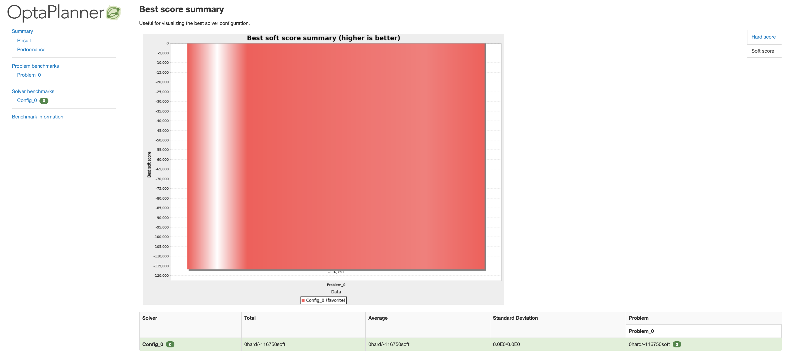
+
. Inspect the _Performance Summary_:
    * This section shows the _Score Calculation Speed* of your configuration. This calculation speed is extremely important in an OptaPlanner project. The higher the calculation speed, the more moves OptaPlanner can execute and calculate in a given timeframe, the better the solution that OptaPlanner provides. A _Score Calculation Speed_ below 1000m should be addressed.
+
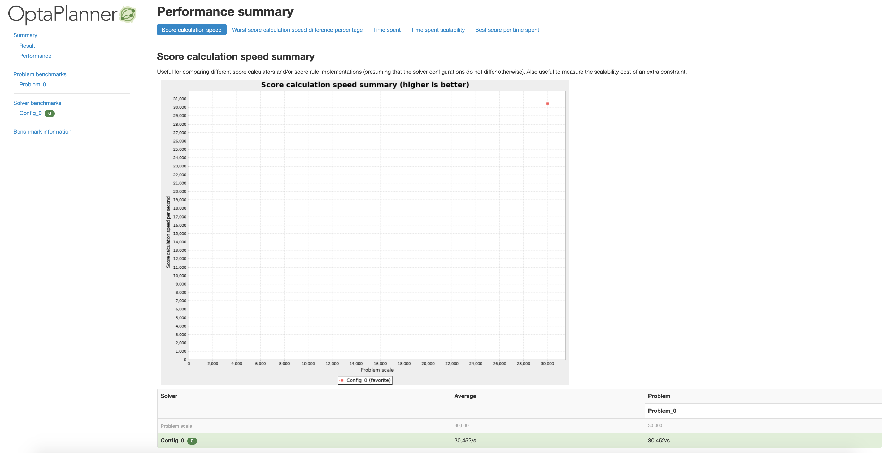
+
. Inspect the _Problem Benchmarks_ section:
    * This part of the report shows the progression of the _score_ over _time. As stated earlier, in the beginning of an OptaPlanner run, the score usually improves very quickly, after which finding better solutions slows down. The graph shown in the benchmark report clearly visualizes this. This is a great tool to:
        ... Inspect whether your solver follows this common pattern. If it does not, this usually indicates a problem in your solution, for example, a _score calculation count_ that is too low, or a problem that is stuck in a _local optima_.
        ... Compare the score progression of multiple solver configurations to determine which solver configuration works best for your planning problem.
        ... The point of _diminishing returns_, which can indicate how long you should run the solver (on an environment with comparable hardware).

image:images/optaplanner-benchmark.png[]


Furthermore, the report shows the actual _Solver Configuration_ used for each run, as well as information of the system on which the benchmark ran.


=== Conclusion

In this lab you've implemented your first OptaPlanner solution. We've used the _Cloud Balancing_ example as our _planning problem_, in which we needed to assign processes to computers in such a way that we minimize the costs of our computers.

We started with a given domain model that we annotated with OptaPlanner annotations. This was required in order to provide OptaPlanner with the meta-data about the domain model (i.e. what is the `PlanningEntity`, what are the `PlanningVariables`) it needs to run its _Solver_.

After that we implemented the _constraint rules_ that calculate the score of a given solution. This provides OptaPlanner with the information it needs to be able to compare different solutions and determine which solution is the better solution.

We've looked at the OptaPlanner API. We've seen how an OptaPlanner `Solver` can be created from a _solver configuration_, how data-sets of our problem can be loaded, and how we can pass a given data-set to an OptaPlanner `Solver` for it to be solved.

Finally we've looked at the OptaPlanner Benchmarker, an important tool in an OptaPlanner project to analyse, visualize, inspect and maintain the health and performance of your OptaPlanner solution.

=== Next steps

This was a brief introduction to OptaPlanner which has shown you the basic concepts of the platform. The platform provides a vast array of features and functionality to solve planning problems in virtually any domain. Some examples of these features are:

* Chained planning variables to support, for example, `Vehicle Routing Problems (VRP)`.
* Overconstrained-planning.
* Realtime-planning: in which the data-set can change in realtime.
* Heatmaps to visualize which constraints lead to a certain score (i.e. to be able to explain the score).

More information about OptaPlanner can be found at: https://www.optaplanner.org . This includes the full documentation, examples, trainings and presentations.
